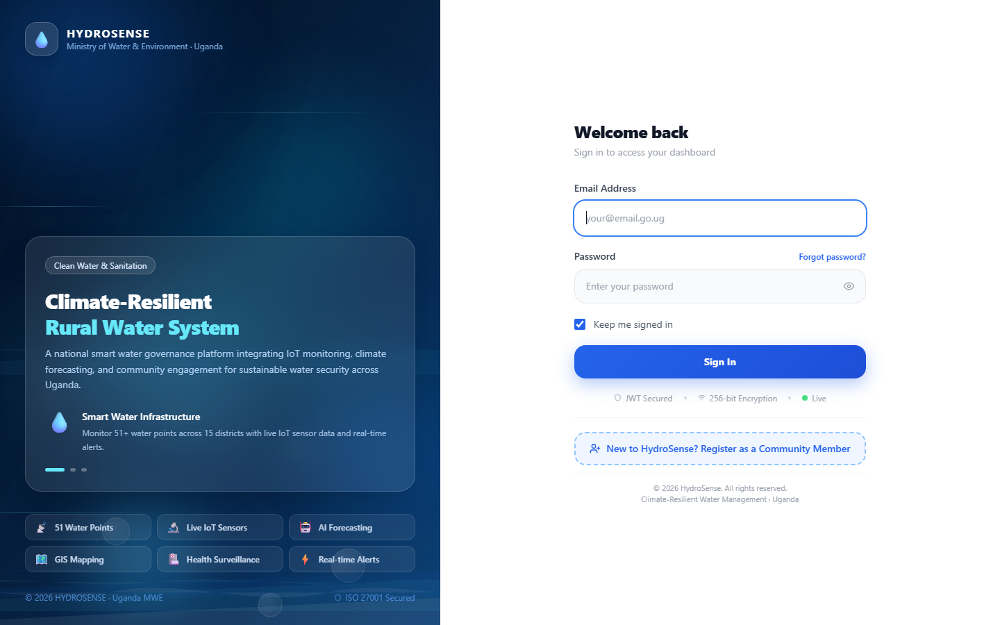
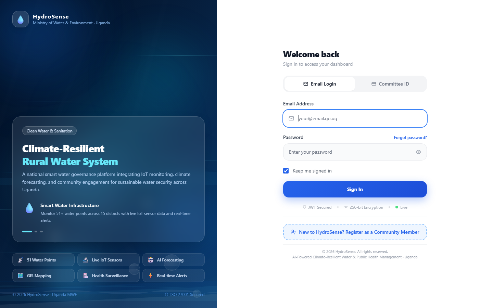
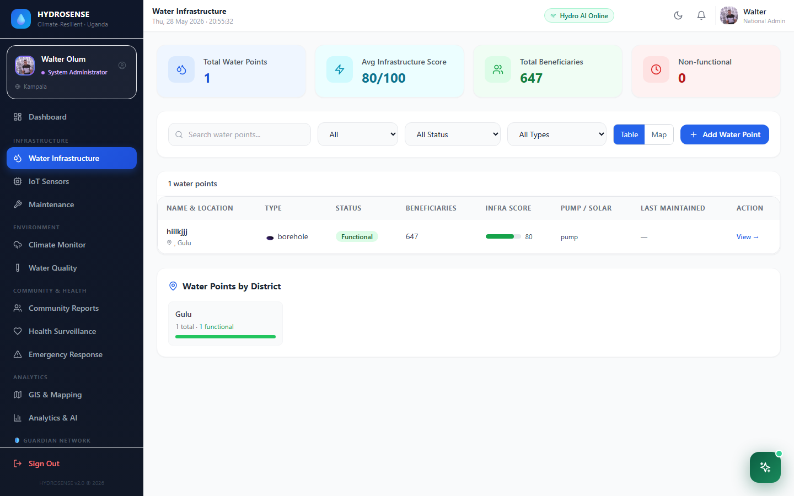
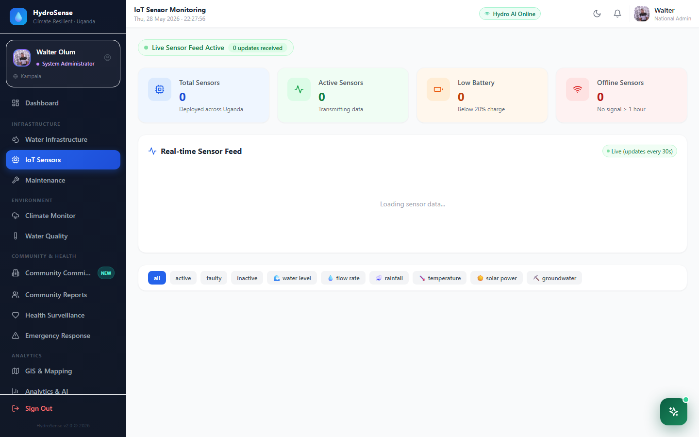
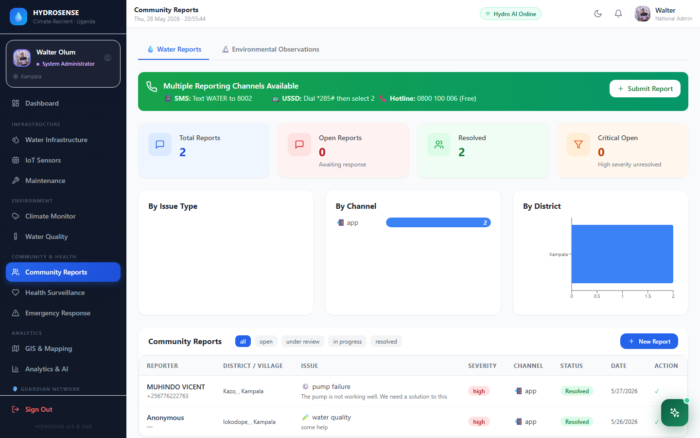
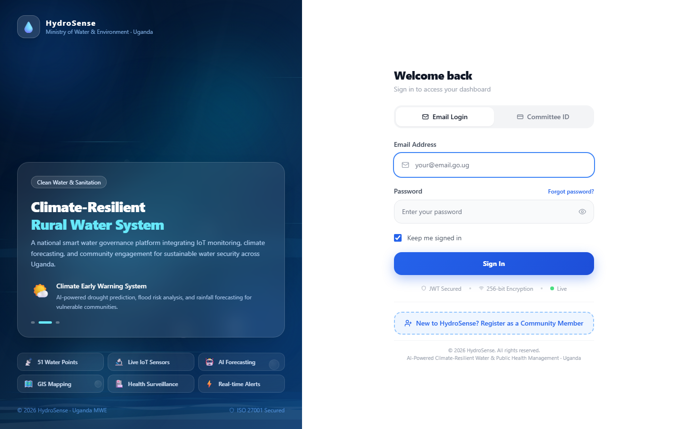
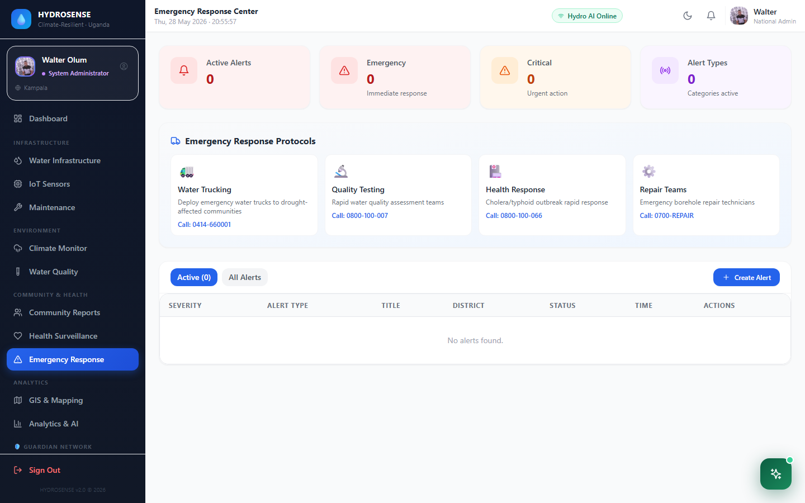
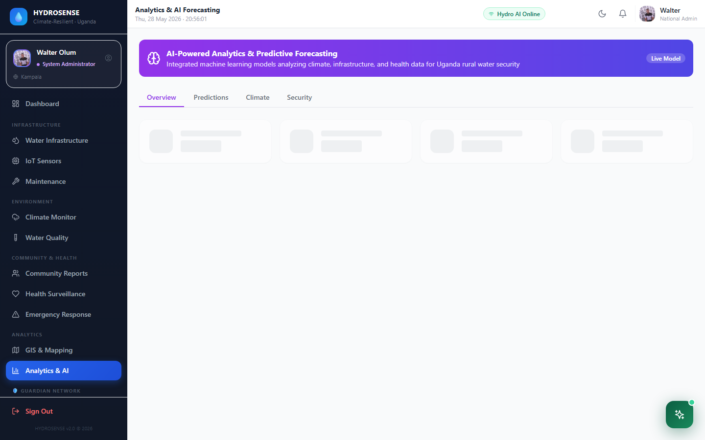
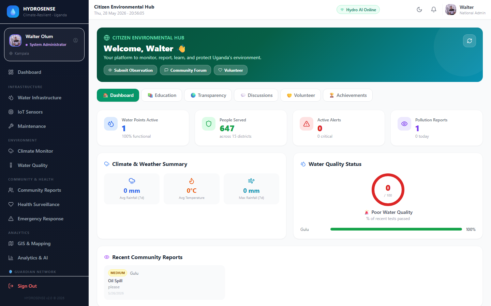
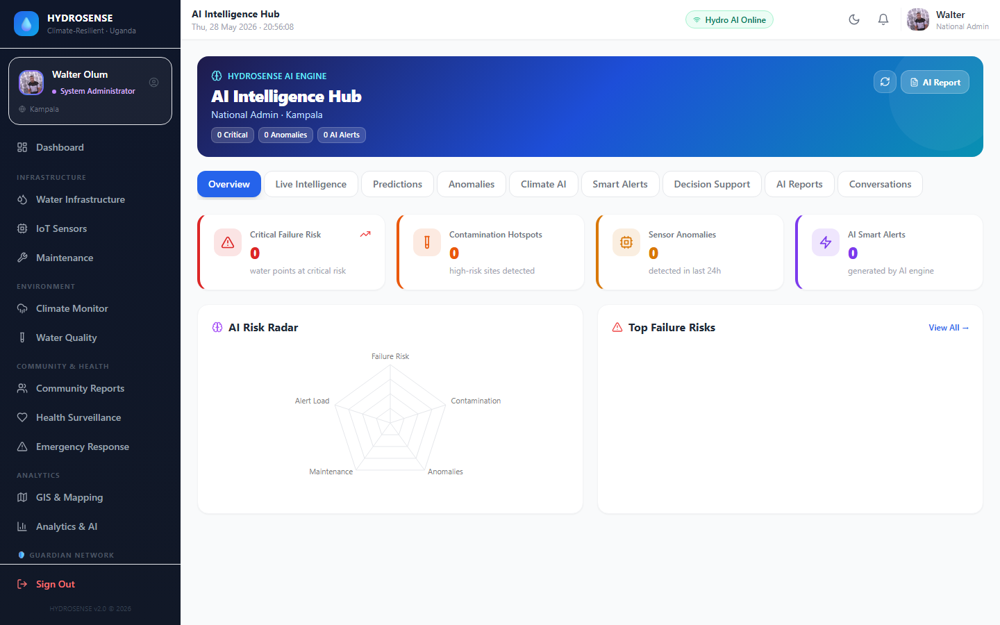

# 💧 HydroSense
### Climate-Resilient Rural Water & Environment Management System

*Empowering Uganda's communities through intelligent water stewardship*

 

> **HydroSense** is a full-stack, enterprise-grade environmental monitoring platform designed for rural Uganda. It bridges the gap between government institutions, field technicians, health officers, and ordinary citizens — delivering real-time water quality intelligence, AI-powered incident response, and community-driven environmental stewardship at scale.

 

[🚀 Live Demo](https://veltrix-4r2c.vercel.app) · [📖 Documentation](#documentation) · [🐛 Report Bug](https://github.com/muzoora2000/veltrix/issues) · [💡 Request Feature](https://github.com/muzoora2000/veltrix/issues)

---

## 📌 Table of Contents

- [Overview](#-overview)
- [Key Features](#-key-features)
- [System Architecture](#-system-architecture)
- [Tech Stack](#-tech-stack)
- [Modules](#-modules)
- [Getting Started](#-getting-started)
- [Environment Variables](#-environment-variables)
- [User Roles](#-user-roles)
- [Screenshots](#-screenshots)
- [Author](#-author)

---

## 🌍 Overview

Uganda faces a critical water crisis — over **60% of rural communities** lack access to safe, reliable water. Contamination, infrastructure failure, and delayed government response cost lives daily.

**HydroSense** was built to change that.

It is a unified platform that connects IoT sensors, citizen reporters, field technicians, health officers, climate scientists, and national administrators into a single, intelligent ecosystem. Every report, sensor reading, and maintenance request flows through a real-time pipeline that triggers the right response — automatically.

---

## ✨ Key Features

### 🔬 Real-Time Monitoring
- **IoT Sensor Dashboard** — live readings from water quality sensors (pH, turbidity, TDS, flow rate)
- **Climate & Drought Intelligence** — drought index, flood alerts, 7-day forecasts per district
- **Water Quality Lab** — lab test submissions, trend analysis, contamination alerts

### 🗺️ GIS & Spatial Intelligence
- **Interactive Map** — all water points, sensors, and incidents on a live Uganda map
- **District Boundary Overlays** — all 146 Uganda districts with water access layers
- **Live GPS Location** — field officers share real-time location with reverse geocoding

### 🤖 AI Intelligence Hub
- **HYDRA Chatbot** — context-aware AI assistant with full system data access
- **Incident Analysis Engine** — automated risk scoring and priority classification
- **AI Forecasting** — predictive analytics for water security and climate risk
- **Multilingual Voice Input** — voice reports transcribed and translated across all Ugandan languages

### 👥 Community & Citizen Science
- **Community Forum** — discussions with @mentions, media attachments, likes, and read receipts
- **Guardian Water Network (GWN)** — citizen science programme for environmental observation
- **Volunteer Events** — join, organise, and get real-time alarms for community water activities
- **Multi-channel Reporting** — submit incidents via App, SMS, WhatsApp, Email, or Phone

### 🏥 Public Health Integration
- **Disease Outbreak Tracker** — automatic health incident creation from citizen disease reports
- **Outbreak Alerts** — triggers when case count crosses threshold (≥10 cases)
- **Health Authority Dashboard** — district-level surveillance and trend mapping

### ⚡ Emergency Response
- **Incident Command Centre** — classify, assign, and track environmental emergencies
- **Response Tickets** — full lifecycle management from detection to resolution
- **Live Emergency Map** — real-time field agent locations and incident clusters

### 🔔 Smart Notifications
- **Role-based Alerts** — each role receives only relevant system notifications
- **Event Alarms** — popup + sound alerts at 30 min, 5 min, and event start
- **In-app Notification Panel** — with deep-link navigation to the relevant record

### 🏛️ Governance & Transparency
- **Audit Trail** — complete log of all system actions with user attribution
- **Budget Tracking** — water infrastructure fund allocation and expenditure
- **Performance Metrics** — KPI dashboards for accountability reporting

---

## 🏗️ System Architecture

<pre>
┌─────────────────────────────────────────────────────────────┐
│                        HydroSense                           │
├──────────────┬──────────────────────┬───────────────────────┤
│   Frontend   │       Backend        │      AI Service       │
│              │                      │                       │
│  React 18    │   Node.js / Express  │   Python / FastAPI    │
│  TypeScript  │   PostgreSQL         │   Google Gemini       │
│  Tailwind    │   Socket.IO          │   Multilingual NLP    │
│  Vite        │   JWT Auth           │   Risk Scoring        │
│  Leaflet     │   node-cron          │   Auto Assignment     │
│  Recharts    │   Nodemailer         │   Offline Queue       │
│  Socket.IO   │   Africa's Talking   │                       │
└──────────────┴──────────────────────┴───────────────────────┘
         │                  │                    │
         └──────────────────┼────────────────────┘
                            │
                            ▼
              ┌─────────────────────────────┐
              │      Deployment Layer       │
              │   Vercel  (Frontend)        │
              │   Render  (Backend + AI)    │
              └─────────────────────────────┘
</pre>

---

## 🛠️ Tech Stack

| Layer | Technology |
|-------|-----------|
| **Frontend** | React 18, TypeScript, Vite, Tailwind CSS |
| **State & Routing** | React Router v6, Context API |
| **Charts & Maps** | Recharts, Leaflet, React-Leaflet |
| **Real-time** | Socket.IO Client |
| **Backend** | Node.js, Express.js |
| **Database** | PostgreSQL (Render managed) |
| **Authentication** | JWT, bcryptjs |
| **Real-time** | Socket.IO |
| **Scheduling** | node-cron |
| **SMS / OTP** | Africa's Talking, Twilio |
| **Email** | Nodemailer, Brevo |
| **AI Service** | Python, FastAPI, Uvicorn |
| **AI Models** | Google Gemini 2.5 Flash |
| **Deployment** | Vercel (frontend), Render (backend + AI) |

---

## 📦 Modules

| Module | Description | Access |
|--------|-------------|--------|
| Dashboard | System-wide KPIs and live activity feed | All staff |
| Water Infrastructure | Water point registry and condition tracking | All staff |
| IoT Sensors | Live sensor readings and historical graphs | All staff |
| Climate Monitor | Drought, flood, and forecast data | All staff |
| Water Quality | Lab test submissions and quality analysis | All staff |
| Maintenance Tracker | Work order lifecycle management | Technicians, Admins |
| Community Reports | Multi-channel incident reports from citizens | All staff |
| Public Health | Disease surveillance and outbreak detection | Health Officers, Admins |
| Emergency Response | Incident command and field coordination | All staff |
| GIS Mapping | Spatial visualisation of all system data | All staff |
| Analytics | AI predictions and trend forecasting | All staff |
| AI Hub | HYDRA chatbot and AI report generation | All staff |
| Governance | Audit logs, budget, and transparency reports | Admins |
| User Management | Role assignment and account control | Admins |
| Technician Portal | Personal task queue for field technicians | Technicians |
| Citizen Hub | Community forum, GWN, volunteer events | Citizens |
| Citizen Report | Public incident submission (no login required) | Public |
| Incident Command | Environmental emergency coordination | Officers, Admins |

---

## 🚀 Getting Started

### Prerequisites

- Node.js 18+
- Python 3.11+
- PostgreSQL 15+
- npm or yarn

### Installation

1. Clone the repository — `git clone https://github.com/muzoora2000/veltrix.git` then `cd veltrix`
2. Install backend dependencies — `cd server && npm install`
3. Install frontend dependencies — `cd ../client && npm install`
4. Set up the AI service — `cd ../ai-service`, create a virtual environment with `python -m venv .venv`, activate it, then run `pip install -r requirements.txt`

### Running Locally

Open three terminal windows:

- Terminal 1 (Backend) — `cd server && npm run dev`
- Terminal 2 (Frontend) — `cd client && npm run dev`
- Terminal 3 (AI Service, optional) — `cd ai-service && uvicorn main:app --reload --port 8000`

The app will be available at http://localhost:5173

---

## 🔐 Environment Variables

### Server — server/.env

| Variable | Description |
|----------|-------------|
| PORT | Server port (default: 5000) |
| NODE_ENV | Environment (development / production) |
| DATABASE_URL | PostgreSQL connection string |
| JWT_SECRET | Secret key for JWT signing |
| GEMINI_API_KEY | Google Gemini API key |
| AT_API_KEY | Africa's Talking API key |
| AT_USERNAME | Africa's Talking username |
| BREVO_API_KEY | Brevo email API key |
| SMTP_EMAIL | Sender email address |
| SMTP_PASS | Email app password |

### AI Service — ai-service/.env

| Variable | Description |
|----------|-------------|
| GEMINI_API_KEY | Google Gemini API key |
| DATABASE_URL | PostgreSQL connection string |

---

## 👤 User Roles

| Role | Description |
|------|-------------|
| `national_admin` | Full system access, user management, governance |
| `district_officer` | District-level oversight and reporting |
| `community_committee` | Community liaison and local coordination |
| `ngo_officer` | NGO partner access to relevant modules |
| `technician` | Field task management and maintenance |
| `health_officer` | Public health surveillance and incident review |
| `climate_scientist` | Climate data analysis and forecasting |
| `citizen` | Community forum, GWN, volunteer events, reporting |

---

## 📸 Screenshots

### Login

### Dashboard

### Water Infrastructure

### IoT Sensors

### Water Quality

### Community Reports

### GIS & Spatial Mapping

### Health Surveillance

### Emergency Response

### Analytics & AI

### Citizen Hub

### AI Intelligence Hub

---

## 👨‍💻 Author

**HydroSense Developers**

*Lead Developer & System Architect*

Bachelor of Software Engineering — Cavendish University Uganda

---

**HydroSense** — *Because clean water is not a privilege. It is a right.*

⭐ Star this repository if you believe in what it stands for.

